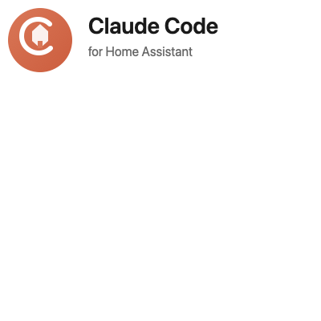

# Claude Code for Home Assistant

Access Claude Code directly from your Home Assistant interface with full control over your configuration files and smart home devices via MCP integration.

## Features

- **Web-based terminal** running Claude Code CLI
- **MCP Integration** - Control Home Assistant devices directly via Claude
- **Full read/write access** to `/config` directory
- Edit automations, scripts, scenes, and more with AI assistance
- Integrated in HA sidebar via ingress
- Works with HA Core commands (`ha core check`, `ha core restart`)

## MCP (Model Context Protocol) Integration

This addon comes with built-in MCP support for Home Assistant. Claude Code can:

- **Control devices** - Turn lights on/off, adjust brightness, set temperatures
- **Check states** - Query sensor values, device status, and more
- **Activate scenes** - Run your pre-configured scenes
- **Manage climate** - Set thermostats and HVAC controls
- **Media control** - Play/pause, volume, and track control

### Example Commands

Ask Claude things like:
- "Turn on the living room lights"
- "Set the bedroom temperature to 72 degrees"
- "What's the current status of all my motion sensors?"
- "Activate the 'Movie Night' scene"
- "Turn off all lights on the main floor"

## Installation

1. Add this repository to your HA add-on store
2. Go to Settings → Add-ons → Add-on Store
3. Click the menu (⋮) → Repositories
4. Add: `https://github.com/nateober/ha-claude-code-addon`
5. Find "Claude Code for Home Assistant" and click Install

## Configuration

| Option | Description | Default |
|--------|-------------|---------|
| `anthropic_api_key` | Your Anthropic API key (from console.anthropic.com) | - |
| `enable_ha_mcp` | Enable MCP integration for Home Assistant control | `true` |
| `ha_mcp_url` | Custom MCP URL (leave empty for automatic Supervisor proxy) | - |

### Getting an Anthropic API Key

1. Go to [console.anthropic.com](https://console.anthropic.com)
2. Create an account or sign in
3. Navigate to API Keys
4. Create a new key and copy it to the addon configuration

## Usage

1. Open the add-on from the sidebar (Claude Code icon)
2. Claude Code will start in the `/config` directory
3. Ask Claude to help with automations, scripts, scenes, or control devices

### Working with Configuration Files

- "Show me all automations that control the living room lights"
- "Create a new automation that turns off all lights at midnight"
- "Fix the syntax error in my configuration.yaml"
- "Add a new scene called 'Movie Night' that dims the living room to 20%"

### Controlling Devices via MCP

- "Turn on the kitchen lights to 50%"
- "What's the temperature in the bedroom?"
- "Lock the front door"
- "Is the garage door open?"

## Technical Details

- The addon uses the Home Assistant Supervisor token for MCP authentication
- MCP configuration is automatically generated at startup
- Device control works through the standard Home Assistant MCP API
- All Claude Code settings persist across restarts in `/data/.claude`

## Troubleshooting

### MCP not working?

1. Ensure Home Assistant has the MCP integration enabled
2. Check the addon logs for any MCP configuration errors
3. Try restarting the addon

### Can't connect to Claude?

1. Verify your Anthropic API key is correct
2. Check your network/firewall settings
3. Review the addon logs for connection errors

## Support

- [GitHub Issues](https://github.com/nateober/ha-claude-code-addon/issues)
- [Home Assistant Community](https://community.home-assistant.io/)
